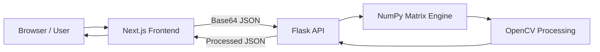

# ⚡ SpectraY — Next-Gen Image Processing Engine

<div align="center">


<br/>


<br/><br/>

**Professional-grade image manipulation powered by Python matrices — running inside your browser.**

🔗 [Live Demo](#) • 🐛 [Report Bug](#) • ✨ [Request Feature](#)

</div>

---

## 📌 Table of Contents

- [🚀 Overview](#-overview)
- [✨ Key Features](#-key-features)
- [🏗 Architecture](#-architecture)
- [🧠 The Math Behind the Magic](#-the-math-behind-the-magic)
- [🚀 Getting Started](#-getting-started)
- [📂 Project Structure](#-project-structure)
- [🔮 Roadmap](#-roadmap)
- [📄 License](#-license)
- [⭐ Support](#-support)

---

## 🚀 Overview

**SpectraY** is a full-stack image processing engine that merges:

👉 Modern web interactivity  
👉 Scientific computer vision algorithms  
👉 Real-time performance  

Unlike traditional web editors that rely on CSS filters, SpectraY sends raw image data to a **Python backend**, converts it into **NumPy matrices**, and performs real mathematical operations using OpenCV.

This enables:

- Edge detection
- Convolution pipelines
- Histogram operations
- Matrix-level precision
- High-performance transformations

> You’re not applying filters — you’re performing real computer vision.

---

## ✨ Key Features

| Feature | Description |
|--------|------------|
| 🎨 Pixel-Perfect Editing | Direct RGB manipulation (Brightness, Contrast, Saturation) |
| ⚡ Real-Time Pipeline | Structural → Color → Finishing workflow |
| 🖼️ Filter Gallery | Gaussian blur, Canny edge, Sharpen kernels |
| 🎛️ Dual Workflow | Studio editor + preset filter library |
| 🛠️ Full-Stack Engine | JSON pipeline between Next.js & Flask |
| 🧮 Matrix Precision | Scientific accuracy via NumPy |

---

## 🏗 Architecture

SpectraY follows a compute-optimized client/server pipeline.



### Frontend

- Next.js 16 (App Router)
- React 18
- Tailwind CSS
- Framer Motion animations
- Smooth canvas rendering

### Backend

- Python 3.10+
- Flask REST API
- OpenCV (cv2)
- NumPy matrix engine

---

## 🧠 The Math Behind the Magic

SpectraY operates on real matrix mathematics.

### Brightness Example

User input: **Brightness +50**

```
M_new(x, y) = M_old(x, y) + 50
```

Values are clamped:

```
0 ≤ pixel ≤ 255
```

This prevents overflow artifacts.

---

### Edge Detection (Canny Algorithm)

1. Gaussian blur reduces noise
2. Gradient intensity computed (Gx, Gy)
3. Non-maximum suppression
4. Hysteresis thresholding

Result → clean, mathematically precise edges.

---

## 🚀 Getting Started

### ✅ Prerequisites

- Node.js v18+
- Python v3.8+

---

### 1️⃣ Clone Repository

```bash
git clone https://github.com/yourusername/spectray.git
cd spectray
```

---

### 2️⃣ Frontend Setup

```bash
npm install
npm run dev
```

Frontend:

👉 http://localhost:3000

---

### 3️⃣ Backend Setup

Open a new terminal:

```bash
python -m venv venv
source venv/bin/activate   # Windows: venv\Scripts\activate

pip install Flask flask-cors opencv-python-headless numpy

python api/index.py
```

Backend:

👉 http://localhost:5000

---

## 📂 Project Structure

```
/
├── api/                  # Python Backend
│   └── index.py
├── src/
│   ├── app/
│   │   ├── page.js
│   │   └── studio/
│   ├── components/
│   │   ├── ui/
│   │   └── studio/
│   └── utils/
├── public/
└── next.config.mjs
```

---

## 🔮 Roadmap

- [x] Core editor (brightness, contrast, rotation)
- [x] Filter presets (sepia, grayscale, invert)
- [ ] Neural style transfer (PyTorch)
- [ ] Procedural workspace generator
- [ ] Batch image processing
- [ ] GPU acceleration support

---

## 📄 License

Distributed under the **MIT License**.

See `LICENSE` for full details.

---

## ⭐ Support

If you like SpectraY:

- ⭐ Star the repository
- 🍴 Fork it
- 🧠 Contribute filters
- 🐛 Report issues

Open source grows through community.

---

<div align="center">

**Built with ❤️ using computer vision & modern web engineering**

</div>
